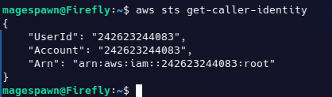
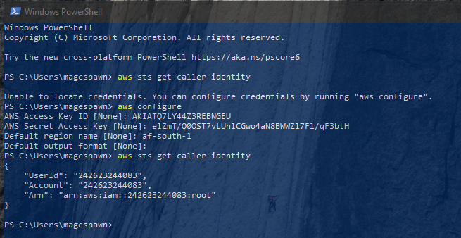

# Week 0 — Billing and Architecture

## Required Homework

### Install AWS command Line

I have installed the Gitpod version and the local machine AWS CLi on Windows and Linux.

#### Linux Install

```
curl "https://awscli.amazonaws.com/awscli-exe-linux-x86_64.zip" -o "awscliv2.zip"
unzip awscliv2.zip
sudo ./aws/install
aws --version
```

Ouput from aws --version

magespawn@Firefly:~$ aws --version
aws-cli/2.10.0 Python/3.9.11 Linux/5.19.0-31-generic exe/x86_64.ubuntu.22 prompt/off



#### Windows Install

Download and run the AWS CLI MSI https://awscli.amazonaws.com/AWSCLIV2.msi

```
PS C:\Users\magespawn> aws --version                                                                                    
aws-cli/2.10.1 Python/3.9.11 Windows/10 exe/AMD64 prompt/off        
```

